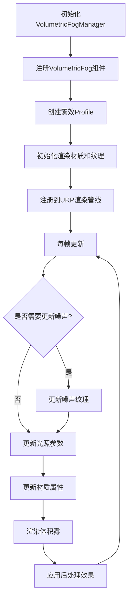
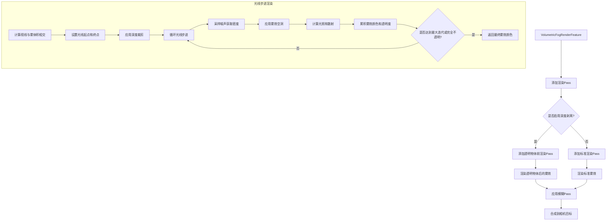

E:\Project\FogMist# Volumetric Fog 2 技术文档

本文档详细介绍了Volumetric Fog 2插件的实现原理、渲染流程和关键技术细节。

## 目录

1. [整体执行流程](#整体执行流程)
2. [渲染流程](#渲染流程)
3. [类和Shader功能说明](#类和shader功能说明)
4. [关键技术细节](#关键技术细节)

## 整体执行流程



## 渲染流程




## 类和Shader功能说明

### 核心类

1. **VolumetricFogManager**
   - 管理全局雾效设置
   - 处理太阳和月亮的光照
   - 控制深度纹理和渲染设置
   - 管理点光源和雾效空洞

2. **VolumetricFog**
   - 主要的雾效组件
   - 处理雾效体积的渲染
   - 更新噪声纹理和材质属性
   - 支持子体积和配置文件

3. **VolumetricFogProfile**
   - 存储雾效的所有参数
   - 控制密度、颜色、形状等属性
   - 管理噪声和光照设置
   - 支持渐变和动画效果

4. **VolumetricFogRenderFeature**
   - 集成到URP渲染管线
   - 添加自定义渲染Pass
   - 处理深度剥离和模糊效果

5. **FogPointLight**
   - 为点光源提供雾效照明
   - 控制光照强度和散射

6. **FogVoidManager**
   - 管理雾效中的空洞区域
   - 支持不同形状的空洞

### 主要Shader文件

1. **VolumetricFog2DURP.shader**
   - 主要的雾效渲染Shader
   - 处理光线步进和体积渲染

2. **Raymarch2D.cginc**
   - 实现光线步进算法
   - 计算雾效密度和光照

3. **ShadowsURP.cginc**
   - 处理阴影计算
   - 集成URP阴影系统

4. **Surface.cginc**
   - 处理表面交互
   - 计算雾效与表面的关系

5. **FogVoids.cginc**
   - 实现雾效空洞
   - 计算空洞对雾效的影响

6. **APV.cginc**
   - 支持自适应探针体积
   - 增强光照效果

7. **PointLights.cginc**
   - 处理点光源对雾效的影响
   - 计算光照散射

8. **FogOfWar.cginc**
   - 实现战争迷雾效果
   - 动态控制雾效可见性

## 关键技术细节

### 1. 光线步进(Raymarch)技术

体积雾使用光线步进技术来渲染三维体积效果。主要步骤包括：

- **光线与体积相交计算**：确定光线与雾效体积的交点
- **自适应步长**：根据距离动态调整步长，近处精细，远处粗略
- **密度采样**：在每个步进点采样噪声纹理获取密度
- **光照积累**：累积每个采样点的光照和散射效果
- **透明度混合**：使用前向渲染混合雾效颜色

关键代码片段：
```hlsl
half4 GetFogColor(float3 rayStart, float3 viewDir, float2 uv, float t0, float t1) {
    float len = t1 - t0;
    float rs = MIN_STEPPING + max(log(len), 0) * FOG_STEPPING;
    // ...
    for (loop_t = 0; loop_t < 1.0; loop_t += rs) {
        AddFog(rayStart, wpos, uv, energyStep, lightColor, sum);
        if (sum.a > 0.99) break;
        wpos += viewDir;
    }
    // ...
}
```

### 2. 噪声生成与动画

体积雾使用多层噪声来创建自然的雾效：

- **基础噪声**：使用2D噪声纹理提供基本形状
- **细节噪声**：可选的3D噪声提供额外细节
- **湍流效果**：通过时间动画创建流动效果
- **风向控制**：模拟风对雾的影响

噪声生成过程：
```csharp
void UpdateNoise() {
    // ...
    turbAcum += Time.deltaTime * activeProfile.turbulence;
    turbulenceMat.SetFloat(ShaderParams.TurbulenceAmount, turbAcum);
    turbulenceMat.SetFloat(ShaderParams.NoiseStrength, activeProfile.noiseStrength);
    Graphics.Blit(noiseTex, rtTurbulence, turbulenceMat);
    // ...
}
```

### 3. 光照散射模型

体积雾实现了多种光照散射模型：

- **简单散射**：基于视线与光源方向的夹角
- **平滑散射**：使用Henyey-Greenstein相位函数
- **强散射**：使用Mie散射模型

散射计算：
```hlsl
half GetDiffusionIntensity(float3 viewDir) {
    half cosTheta = max(dot(viewDir, _SunDir.xyz), 0);
    #if VF2_DIFFUSION_SMOOTH
        half diffusion = HenyeyGreenstein(cosTheta, LIGHT_DIFFUSION_POWER);
    #elif VF2_DIFFUSION_STRONG
        half diffusion = MiePhase(cosTheta, LIGHT_DIFFUSION_POWER);
    #else
        half diffusion = SimpleDiffusionIntensity(cosTheta, LIGHT_DIFFUSION_POWER);
    #endif
    return diffusion * LIGHT_DIFFUSION_INTENSITY;
}
```

### 4. 深度集成与透明物体处理

体积雾与场景深度无缝集成：

- **深度裁剪**：使用场景深度限制光线长度
- **深度剥离**：支持透明物体的正确渲染
- **深度渐变**：基于深度的颜色渐变

深度处理：
```hlsl
void CLAMP_RAY_DEPTH(float3 rayStart, float2 uv, inout float t1) {
    float depth = GetRawDepth(uv);
    float3 wpos = ComputeWorldSpacePosition(uv, depth, unity_MatrixInvVP);
    float z = distance(rayStart, wpos);
    t1 = min(t1, z);
}
```

### 5. 高级渲染特性

- **自适应探针体积(APV)**：支持Unity 2023.1+的APV光照
- **点光源支持**：雾效对点光源和聚光灯做出反应
- **阴影接收**：雾效可以接收和显示阴影
- **光照Cookie**：支持光照Cookie纹理
- **雾效空洞**：创建不含雾的区域
- **战争迷雾**：动态控制雾效可见性

### 6. 性能优化

- **降采样渲染**：可选的降采样提高性能
- **模糊Pass**：平滑降采样的结果
- **自适应步长**：根据距离优化采样数量
- **早期终止**：当雾效完全不透明时提前结束光线步进
- **可配置的噪声大小**：根据设备性能调整噪声纹理大小

### 7. 远距雾效

为了优化性能，远距离使用简化的指数雾效：

- **距离雾**：覆盖远处地平线和天空
- **高度雾**：基于高度的雾效密度
- **无缝过渡**：与近处体积雾无缝融合

```hlsl
float d = (t1 - startDistance) * DISTANCE_DENSITY;
float hitPosY = max(MIN_ALTITUDE, hitPos.y + rayStart.y - BASE_ALTITUDE);
float h = (hitPosY != 0 ? MAX_HEIGHT / abs(hitPosY) : MAX_HEIGHT) * HEIGHT_DENSITY;
float f = min(d, h);
half sum = exp2(-f);
```
