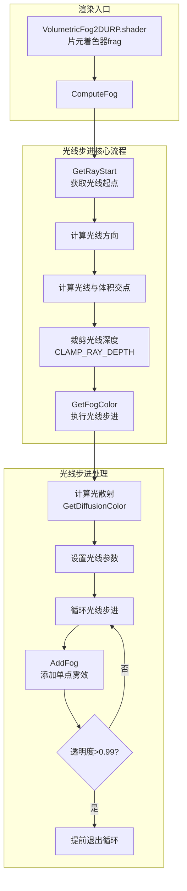
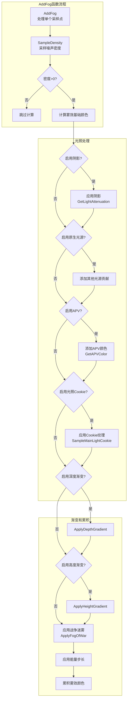
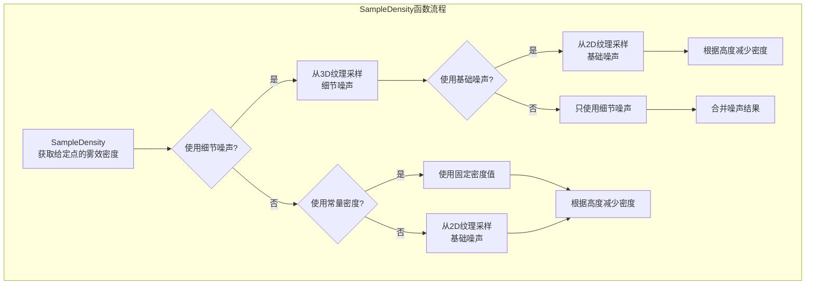
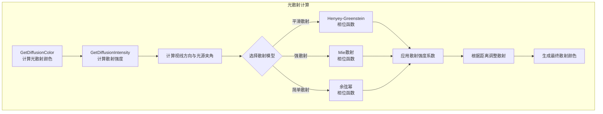
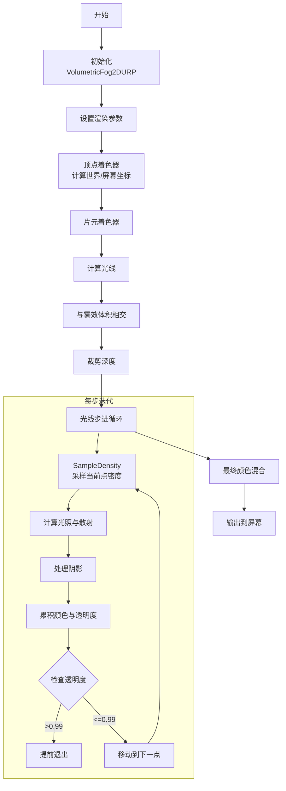

# Volumetric Fog 2 着色器处理流程

## 核心渲染流程

## 雾效采样和计算流程

## 密度采样和噪声处理

## 光散射模型处理

## 完整的光线步进过程

## 核心函数说明

| 函数名 | 文件 | 作用 |
|--------|------|------|
| `ComputeFog` | Raymarch2D.cginc | 主要雾效计算函数，处理光线与雾效体积的交互 |
| `GetFogColor` | Raymarch2D.cginc | 执行实际的光线步进，累积雾效颜色 |
| `AddFog` | Raymarch2D.cginc | 在光线步进中的单个采样点添加雾效贡献 |
| `SampleDensity` | Raymarch2D.cginc | 采样给定世界空间位置的雾效密度 |
| `GetDiffusionIntensity` | Raymarch2D.cginc | 根据视线方向计算散射强度 |
| `GetDiffusionColor` | Raymarch2D.cginc | 计算最终的散射光颜色 |
| `frag` | VolumetricFog2DURP.shader | 片元着色器，渲染入口点 |
| `vert` | VolumetricFog2DURP.shader | 顶点着色器，准备顶点数据 |

## 性能优化点

1. **自适应步长**: 根据距离动态调整步长，远处使用更大的步长以提高性能
2. **提前退出**: 当雾效完全不透明时提前结束光线步进
3. **降采样渲染**: 可选的降采样提高性能
4. **条件编译**: 使用预处理指令有选择地编译需要的功能

## 主要特效控制点

1. **噪声纹理**: 控制雾效的形状和细节
2. **光散射模型**: 控制光在雾中的散射方式 (简单/平滑/强散射)
3. **深度和高度渐变**: 根据深度和高度改变雾效的外观
4. **阴影接收**: 允许雾效接收和显示场景中的阴影
5. **风向动画**: 通过偏移噪声纹理UV创造风吹动的效果 