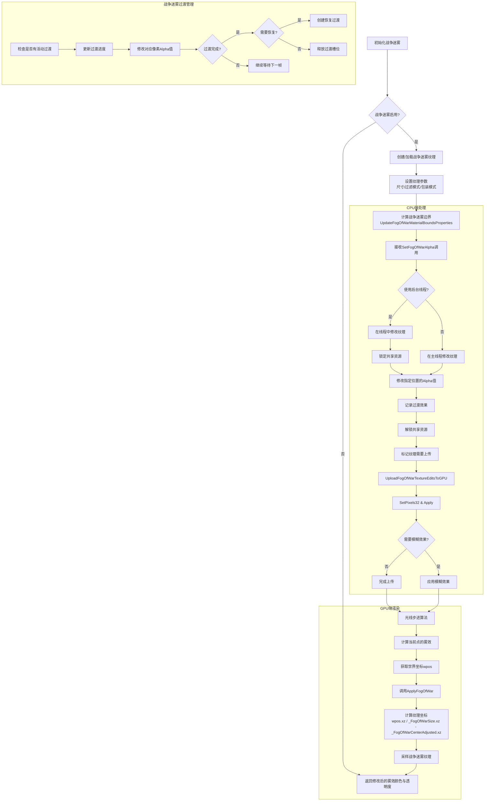

# 战争迷雾系统文档

## 概述
战争迷雾(Fog of War)是一种游戏机制，特别常见于RTS(即时战略)游戏中，用于限制玩家对地图区域的可见性。在VolumetricFog2系统中，战争迷雾是通过一个特殊的纹理实现的，该纹理可动态修改以揭示或隐藏场景的不同部分。

## 战争迷雾处理流程图



### 战争迷雾的直观理解  
战争迷雾系统实际上是将一个大的2D纹理叠加在游戏世界的顶部，就像一张俯视图。这个纹理的每个像素都控制着相应世界位置的雾的透明度。 
1. 纹理坐标变换的目的是将世界位置映射到这个2D纹理上的正确位置。  
## 实际应用场景：  
• 在RTS游戏中，当玩家单位移动到未探索区域时，会调用SetFogOfWarAlpha函数，传入单位的位置和视野半径  
• 系统将世界坐标转换为纹理坐标，并在纹理上相应位置修改透明度值  • 在渲染过程中，着色器使用当前渲染点的世界坐标，计算对应的纹理坐标，然后采样纹理获取透明度值   

## 扩展应用  
这种世界空间到纹理空间的映射技术在游戏开发中有许多应用：
 1. 动态地形修改：类似于战争迷雾，但用于修改地形纹理，如在RTS游戏中显示被破坏的地形  
 2. 动态阴影投射：在地面上投射动态阴影时，也需要类似的坐标变换  
 3. 投影贴图：如在地面上投射图标、范围指示器等  
 4. 交互式地图标记：在小地图或战略地图上放置标记时   
 ## 优化考虑  
 • 精度问题：在大型世界中，这种映射可能会有精度问题。解决方法是使用分块的战争迷雾系统  
 • 性能优化：通过在CPU上判断哪些区域需要更新（而不是整个纹理），可以显著提高性能  
 • 内存优化：对于超大地图，可以使用动态加载的分块纹理系统   通过这种坐标映射机制，战争迷雾系统能够有效地实现世界空间与纹理空间的无缝交互，为游戏提供动态的视觉效果和游戏机制。

## 核心原理
战争迷雾系统采用一个2D纹理来控制场景中不同区域的体积雾透明度。纹理的alpha通道用于确定每个位置的雾气密度：
- alpha = 0：完全无雾（完全可见）
- alpha = 255：完全不透明（完全被雾气覆盖）

在着色器中，通过函数`ApplyFogOfWar`将世界坐标转换为战争迷雾纹理坐标，然后采样该纹理以确定该位置的雾气可见性。

## 关键功能

### 坐标转换
战争迷雾系统使用以下公式将世界位置转换为纹理坐标：

```glsl
float2 fogTexCoord = wpos.xz / _FogOfWarSize.xz - _FogOfWarCenterAdjusted.xz;
```

其中：
- `wpos`：世界空间中的位置
- `_FogOfWarSize`：战争迷雾覆盖的区域大小
- `_FogOfWarCenterAdjusted`：经过调整的战争迷雾中心点（由`UpdateFogOfWarMaterialBoundsProperties`方法计算）

### 主要操作功能

1. **设置雾气透明度**：
   - `SetFogOfWarAlpha`方法可在指定的世界位置及其周围区域修改雾气透明度
   - 支持多种区域定义方式：点+半径、边界框、碰撞器、网格

2. **透明度过渡**：
   - 支持平滑过渡效果，从当前透明度渐变到目标透明度
   - 可设置延迟恢复，使区域在一段时间后自动恢复到指定的透明度

3. **批量管理**：
   - 系统使用高效的列表和字典结构管理大量并发的透明度过渡
   - 支持最多64000个同时进行的过渡效果

4. **多线程支持**：
   - 可在后台线程执行纹理更新，避免影响主线程性能

## 技术实现

### 纹理管理
- 纹理尺寸可配置（32-2048像素）
- 支持模糊效果，可平滑战争迷雾边缘
- 使用Color32数组缓存纹理数据，仅在需要时更新GPU

### 性能优化
- 使用锁定机制确保线程安全
- 过渡效果使用对象池管理，避免频繁分配内存
- 纹理更新批处理，减少GPU数据传输

## 实际应用场景

1. **RTS游戏探索系统**：
   - 当单位移动时，可调用`SetFogOfWarAlpha`揭示周围区域
   - 使用`fogOfWarRestoreDelay`参数控制区域重新被雾气覆盖的时间

2. **视野系统**：
   - 将建筑或单位的视野范围表示为透明度较低的区域
   - 敌方单位进入已探索但当前不可见的区域时显示为模糊轮廓

3. **渐进式地图揭示**：
   - 使用平滑过渡效果创建渐进式地图揭示体验
   - 可在不同区域应用不同的透明度值，表示不同的可见性级别

## 使用示例

```csharp
// 在玩家位置周围创建一个可见区域
volumetricFog.SetFogOfWarAlpha(playerPosition, 20f, 0f, 0.5f, 0.8f);

// 创建一个临时可见区域，稍后会恢复为雾气覆盖
volumetricFog.SetFogOfWarAlpha(targetPosition, 15f, 0f, 0.5f, 0.8f, 5f, 2f);

// 使用碰撞器定义一个复杂形状的可见区域
volumetricFog.SetFogOfWarAlpha(visionCollider, 0f, false, 0.2f, 0.5f);
``` 