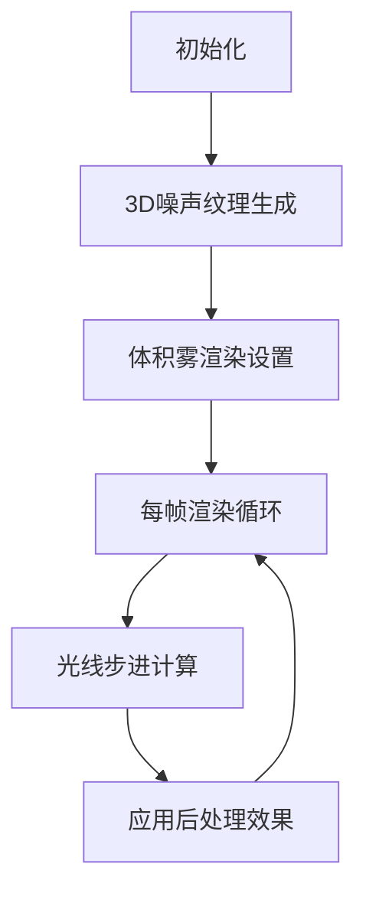
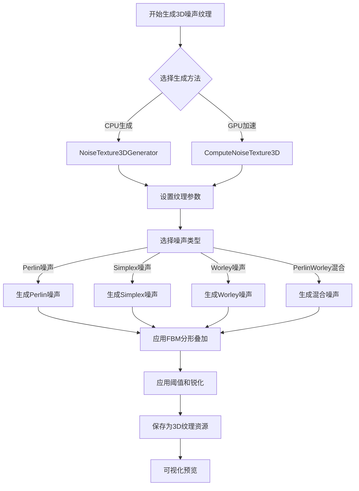
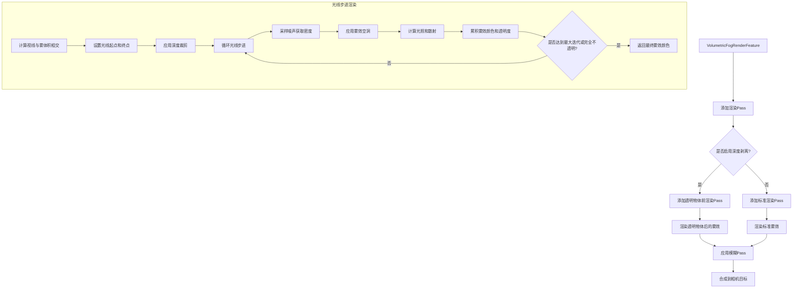
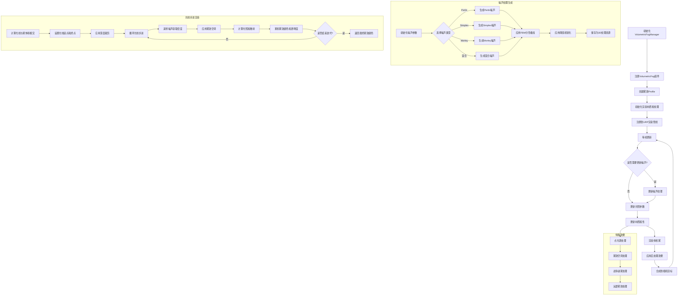
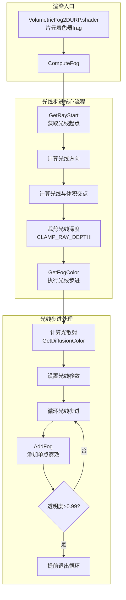
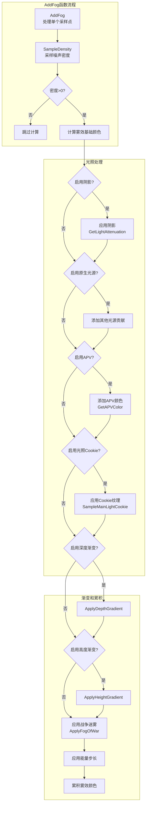
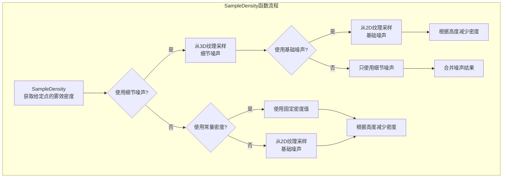
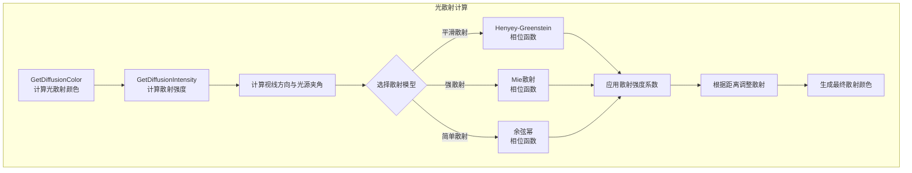

# FogMist 雾效系统技术文档

本文档详细介绍了FogMist项目的雾效处理流程，包括3D噪声纹理生成和体积雾渲染的关键步骤。

## 目录

1. [整体架构](#整体架构)
2. [3D噪声纹理生成流程](#3d噪声纹理生成流程)
3. [体积雾渲染流程](#体积雾渲染流程)
4. [雾效完整处理流程](#雾效完整处理流程)
5. [关键技术细节](#关键技术细节)
6. [代码结构](#代码结构)
7. [体积雾着色器处理流程](#体积雾着色器处理流程)

## 整体架构



## 3D噪声纹理生成流程



## 体积雾渲染流程



## 雾效完整处理流程



## 关键技术细节

### 1. 3D噪声纹理生成

FogMist项目提供了两种生成3D噪声纹理的方法：

#### CPU生成 (NoiseTexture3DGenerator)
- 使用分形布朗运动(FBM)叠加多层Perlin噪声
- 支持阈值和锐化参数调整
- 适合较小分辨率的纹理生成

#### GPU加速 (ComputeNoiseTexture3D)
- 使用Compute Shader并行计算噪声
- 支持多种噪声类型：Perlin、Simplex、Worley和混合噪声
- 适合高分辨率纹理的快速生成

### 2. 光线步进渲染

体积雾使用光线步进技术来渲染三维体积效果：

- **光线与体积相交计算**：确定光线与雾效体积的交点
- **自适应步长**：根据距离动态调整步长，近处精细，远处粗略
- **密度采样**：在每个步进点采样噪声纹理获取密度
- **光照积累**：累积每个采样点的光照和散射效果
- **透明度混合**：使用前向渲染混合雾效颜色

### 3. 光照散射模型

体积雾实现了多种光照散射模型：

- **简单散射**：基于视线与光源方向的夹角
- **平滑散射**：使用Henyey-Greenstein相位函数
- **强散射**：使用Mie散射模型

### 4. 性能优化

- **降采样渲染**：可选的降采样提高性能
- **模糊Pass**：平滑降采样的结果
- **自适应步长**：根据距离优化采样数量
- **早期终止**：当雾效完全不透明时提前结束光线步进

## 代码结构

### 3D噪声纹理生成

1. **NoiseTexture3DGenerator.cs**
   - CPU端生成3D噪声纹理
   - 使用多层Perlin噪声实现FBM

2. **ComputeNoiseTexture3D.cs**
   - 使用Compute Shader加速3D噪声生成
   - 支持多种噪声类型

3. **NoiseTexture3DGenerator.compute**
   - 实现各种噪声算法的Compute Shader
   - 包含Perlin、Simplex、Worley等噪声函数

4. **NoiseTexture3DVisualizer.cs**
   - 可视化3D噪声纹理
   - 支持动画和颜色渐变

### 体积雾渲染

1. **VolumetricFog.cs**
   - 主要的雾效组件
   - 处理雾效体积的渲染
   - 更新噪声纹理和材质属性

2. **VolumetricFogRenderFeature.cs**
   - 集成到URP渲染管线
   - 添加自定义渲染Pass
   - 处理深度剥离和模糊效果

3. **Raymarch2D.cginc**
   - 实现光线步进算法
   - 计算雾效密度和光照

4. **FogVoidManager.cs**
   - 管理雾效中的空洞区域
   - 支持不同形状的空洞

5. **VolumetricFogManager.cs**
   - 管理全局雾效设置
   - 处理太阳和月亮的光照
   - 控制深度纹理和渲染设置

## 体积雾着色器处理流程

### 核心渲染流程



### 雾效采样和计算流程



### 密度采样和噪声处理



### 光散射模型处理



### 核心函数说明

| 函数名 | 文件 | 作用 |
|--------|------|------|
| `ComputeFog` | Raymarch2D.cginc | 主要雾效计算函数，处理光线与雾效体积的交互 |
| `GetFogColor` | Raymarch2D.cginc | 执行实际的光线步进，累积雾效颜色 |
| `AddFog` | Raymarch2D.cginc | 在光线步进中的单个采样点添加雾效贡献 |
| `SampleDensity` | Raymarch2D.cginc | 采样给定世界空间位置的雾效密度 |
| `GetDiffusionIntensity` | Raymarch2D.cginc | 根据视线方向计算散射强度 |
| `GetDiffusionColor` | Raymarch2D.cginc | 计算最终的散射光颜色 |
| `frag` | VolumetricFog2DURP.shader | 片元着色器，渲染入口点 |
| `vert` | VolumetricFog2DURP.shader | 顶点着色器，准备顶点数据 |

### 主要特效控制点

1. **噪声纹理**: 控制雾效的形状和细节
2. **光散射模型**: 控制光在雾中的散射方式 (简单/平滑/强散射)
3. **深度和高度渐变**: 根据深度和高度改变雾效的外观
4. **阴影接收**: 允许雾效接收和显示场景中的阴影
5. **风向动画**: 通过偏移噪声纹理UV创造风吹动的效果

## 更新日志

### 2024-05-28
- 添加了渲染图(RenderGraph)API支持的详细注释
- 完善了RecordRenderGraph函数的文档，说明其作用和调用时机
- 创建了体积雾散射模型说明文档，详细介绍不同光散射模型的原理与效果

### 2024-05-18
- 添加体积雾着色器处理流程详细文档
- 完善光线步进渲染流程图示
- 添加各类关键函数说明和特效控制点

### 2023-11-10
- 添加雾效空洞功能
- 实现风向动画效果
- 添加战争迷雾支持

### 2023-09-22
- 添加GPU加速的噪声生成
- 优化光线步进性能
- 添加多种散射模型

### 2023-07-15
- 初始版本发布
- 实现基础噪声纹理生成
- 实现基本体积雾渲染

### 2023-07-30
- 改进噪声纹理质量
- 添加对光照和阴影的支持
- 实现体积光散射效果

### 2023-08-15
- 添加对点光源和聚光灯的支持
- 完善雾气与场景互动

### 2023-09-01
- 优化光线步进算法，提高性能
- 改进边缘处理，减少锯齿

### 2023-10-10
- 实现动态雾气效果
- 添加风场模拟

### 2023-11-20
- 添加自定义参数界面
- 优化移动平台性能

### 2024-05-14
- 添加战争迷雾功能
  - 实现基于2D纹理的战争迷雾系统
  - 支持通过多种方式定义可见区域（点+半径、边界框、碰撞器、网格）
  - 添加透明度平滑过渡效果，支持延迟恢复
  - 优化性能，支持多线程更新和批量管理
  - 提供丰富的API用于战略游戏视野系统实现

### 2024-06-09
- 体积雾（SimpleVolumeFogFeature）增加对聚光灯（Spot Light）体积光支持，实现聚光灯灯柱雾效。
  - C#端收集场景聚光灯参数，传递到Compute Shader
  - Compute Shader中采样聚光灯锥体内体积雾，叠加灯柱效果

# 体积雾散射模型原理与效果比较

在Volumetric Fog 2插件中，有三种光散射模型用于模拟光线在雾气中的传播行为。每种模型都基于不同的物理散射理论，产生独特的视觉效果。本文详细介绍每种模型的原理和实际效果。

## 1. 简单散射模型 (Simple Diffusion)

```hlsl
half SimpleDiffusionIntensity(half cosTheta, half power) {
    return pow(cosTheta, power); // 简单的余弦幂函数
}
```

### 原理
- 最基础的散射模型，使用余弦幂函数
- 仅考虑视线方向与光源方向之间的夹角(cosTheta)
- power参数控制散射的"锐度"

### 实际效果
- **视觉特点**：在光源方向形成相对简单的亮区
- **适用场景**：轻雾、薄雾，或对性能要求高的场景
- **优点**：计算简单，性能开销最小
- **限制**：不能准确模拟复杂的大气散射现象

当power值较小时(如1-5)，光晕效果较为柔和广泛；当power值较大时(如10-20)，光晕变得更集中、更亮。简单散射在逆光场景下表现平淡，无法显示复杂的体积光效果。

## 2. 平滑散射模型 (Smooth Diffusion) - Henyey-Greenstein

```hlsl
half HenyeyGreenstein(half cosTheta, half g) {
    half g2 = g * g;
    half denom = 1.0 + g2 - 2.0 * g * cosTheta;
    // 标准的Henyey-Greenstein公式
    return (1.0 - g2) / (4.0 * 3.14159265 * pow(denom, 1.5));
}
```

### 原理
- 基于Henyey-Greenstein相位函数，最初用于描述星际尘埃的光散射
- 参数g控制散射的方向性：g>0为前向散射，g<0为后向散射，g=0为各向同性
- 提供更准确的角度分布，特别是侧向散射效果

### 实际效果
- **视觉特点**：更自然的光晕，在侧光条件下有明显改善
- **适用场景**：一般大气雾效、云层效果
- **优点**：平衡了性能和视觉质量，在多数情况下表现良好
- **特殊效果**：可以通过调整g值创造不同的散射效果
  - g=0.1-0.3：轻微前向散射，适合薄雾
  - g=0.7-0.9：强前向散射，适合浓雾
  - g=-0.3左右：后向散射，可以模拟逆光时的辉光效果

在逆光场景中，当阳光从雾后穿透时，平滑散射能创造出更自然的"光芒透射"效果，光的边缘过渡更柔和。在侧光条件下，可以看到更多的体积感。

## 3. 强散射模型 (Strong Diffusion) - Mie散射

```hlsl
half MiePhase(half cosTheta, half g) {
    half g2 = g * g;
    half denom = 1.0 + g2 - 2.0 * g * cosTheta;
    // 修改版的Mie散射公式，增强了前向散射效果
    return 1.5 * ((1.0 - g2) / (2.0 + g2)) * (1.0 + cosTheta * cosTheta) / pow(denom, 1.5);
}
```

### 原理
- 基于Mie散射理论，最适合描述光在水滴等较大颗粒中的散射
- 是对Henyey-Greenstein模型的扩展和强化
- 增加了余弦平方项(1.0 + cosTheta * cosTheta)，在光源方向提供更强的前向散射峰值

### 实际效果
- **视觉特点**：强烈的前向散射光晕，明显的"神光"效果
- **适用场景**：浓雾、烟雾、体积感强的场景，或艺术化渲染
- **优点**：创造戏剧性的光线效果，对体积感的强化最明显
- **特色**：在光源方向产生更强烈的光晕，散射范围更大

在光源直射时(如早晨或傍晚的阳光)，强散射模型会产生明显的光柱和光线穿透效果，特别适合表现阳光穿过树林、窗户或云层的场景。体积感最强，但在某些情况下可能过于夸张，不适合追求真实感的场景。

## 视觉对比与选择指南

### 场景示例比较

1. **薄雾场景**:
   - 简单散射：轻微光晕，性能最佳
   - 平滑散射：柔和自然的光晕，边缘过渡更好
   - 强散射：较为明显的光线穿透效果，可能过强

2. **浓雾场景**:
   - 简单散射：光线扩散有限，穿透感不足
   - 平滑散射：平衡的光线穿透和扩散效果
   - 强散射：戏剧性的光束效果，体积感最强

3. **逆光场景**:
   - 简单散射：几乎没有后向散射
   - 平滑散射：适当的后向散射，能创造柔和辉光
   - 强散射：最强的体积光效果，但可能过于明显

### 参数调整建议

- **散射强度(lightDiffusionIntensity)**：控制整体散射效果的强度
  - 薄雾：0.3-0.5
  - 中等雾气：0.5-0.7
  - 浓雾：0.7-1.0

- **散射力度(lightDiffusionPower)**：
  - 简单散射：低值(1-5)产生柔和效果，高值(10-20)产生集中光晕
  - 平滑/强散射：使用0.1-0.9之间的值，值越高前向散射越强

- **散射深度衰减(lightDiffusionNearDepthAtten)**：
  - 较低值(50-100)：近处散射较强，更强调近景
  - 较高值(200-500)：散射在远处更明显，创造深度感

## 实际应用建议

1. **户外日光场景**：
   - 晴天薄雾：简单散射或低g值的平滑散射
   - 晨雾/黄昏：强散射模型，强调体积光

2. **室内场景**：
   - 灰尘颗粒：平滑散射，g值约0.5-0.7
   - 光束效果：强散射模型

3. **特殊效果**：
   - 神秘氛围：平滑散射，低强度，适中g值
   - 恐怖游戏：强散射，高强度，创造明显光束

4. **时间变化**：
   - 可以在日夜循环中动态切换散射模型
   - 白天使用简单或平滑散射
   - 黄昏/黎明使用强散射，突出体积光

通过组合不同的散射模型、噪声设置和颜色参数，您可以创造出各种丰富的雾效氛围，从自然的环境雾到戏剧性的体积光效果。
